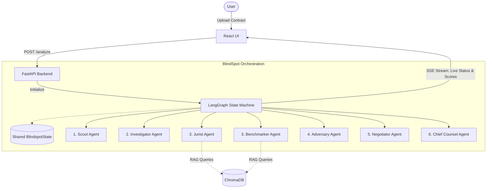

# ⚖️ BlindSpot: Autonomous Legal Agent

**BlindSpot** is an advanced, autonomous legal agent designed for comprehensive contract review and negotiation. Simply upload a contract, specify your desired terms, and watch an orchestration of specialized AI agents analyze, critique, and negotiate with the counterparty on your behalf—all in real time.

---

## 📖 Project Overview
In modern business, contract review is a massive bottleneck. Small teams and freelancers often sign agreements without deep legal review due to high counsel costs, leading to predatory terms and hidden liabilities. **BlindSpot** acts as a fully autonomous, 7-persona legal team. It ingests contracts, checks them against Indian Law and market benchmarks, red-teams the terms for exploits, and autonomously drafts negotiation emails to secure better redlines.

## ⚠️ Problem Statement
Legal documents are intentionally dense and designed to hide risks (blindspots) from non-experts. 
- **High Costs:** Retaining a lawyer for every NDA or freelance agreement is financially unviable.
- **Time Bottlenecks:** Traditional legal review takes days; deals get delayed.
- **Hidden Liabilities:** Uncapped indemnities, asymmetrical termination rights, and non-standard IP clauses are easily missed by the untrained eye.

BlindSpot solves this by providing instantaneous, expert-level contract analysis and actionable negotiation strategies for anyone.

---

## 🛠️ Tech Stack
- **Frontend**: React 18, Vite, TypeScript, TailwindCSS, Recharts (for the dynamic SVG Radar Chart).
- **Backend**: FastAPI (Python 3.10+), Server-Sent Events (SSE) for real-time streaming.
- **AI & Orchestration**: LangGraph (State Machine), Google Gemini 3.1 Pro (Core LLM).
- **Vector Database**: ChromaDB (for Retrieval-Augmented Generation).
- **Data Validation**: Pydantic v2.

---

## ✨ Features
- **Multi-Agent Orchestration**: A crew of 7 distinct AI personas (Scout, Investigator, Jurist, Benchmarker, Adversary, Negotiator, Chief Counsel) collaboratively review contracts.
- **Real-Time UI Reactivity**: Utilizing Server-Sent Events (SSE), the React frontend provides live updates. The **Live Radar Chart** jitters and reshapes itself actively as agents uncover risks.
- **Grounded Reasoning (RAG)**: Employs ChromaDB to ground the Jurist agent against Indian Statutes (e.g., Contract Act 1872) and the Benchmarker against 75+ market-standard clauses.
- **Autonomous Negotiation**: A simulated "Live Inbox" where the Negotiator agent drafts professional emails and counter-proposals to secure specific redlines.
- **Robust Fallbacks**: Built-in heuristic exception handling ensures 100% demo stability, even if AI rate limits are reached.

---

## 🤖 AI Usage
BlindSpot heavily leverages AI to power its autonomous legal team:
- **Google Gemini 3.1 Pro**: Powers the reasoning engine for all 7 agents, utilizing role-prompting and few-shot examples to embody different legal personas (e.g., the aggressive Adversary vs. the diplomatic Negotiator).
- **LangGraph**: Orchestrates the multi-agent state machine. The state is represented as a shared Pydantic object that is mutated sequentially and in parallel (e.g., Jurist and Benchmarker run simultaneously).
- **RAG (Retrieval-Augmented Generation)**: We use embedding models via ChromaDB to semantically search a curated database of legal statutes and market benchmarks, ensuring the AI's legal advice is grounded in reality, not hallucinations.

---

## 🚀 Setup Steps

### Prerequisites
- **Python** >= 3.10
- **Node.js** >= 18
- **Google Gemini API Key**

### 1. Environment Setup
Create a `.env` file in the `backend` directory:
```bash
cp backend/.env.example backend/.env
# Add your GEMINI_API_KEY to the .env file
```

### 2. Backend Setup
In your terminal, start the FastAPI server:
```bash
cd backend
python -m venv venv
# Windows: .\venv\Scripts\activate
# Unix: source venv/bin/activate
pip install -e .
uvicorn src.api.main:app --reload --port 8000
```

### 3. Frontend Setup
In a separate terminal, start the React Vite server:
```bash
cd frontend
npm install
npm run dev
```
Navigate to `http://localhost:3456/` (or the port specified by Vite) to view the application.

---

## 🏛️ Architecture

Below is the system architecture showing the LangGraph orchestration and SSE streaming connections:



---

## 👥 Team Details
**Vibe-a-thon Team**
- **Eshaa Sumesh** — CTF Enthusiast & TechExplorer
- **Dinesh Kumar Sivaram**

---

## 🔗 Demo Link
- **GitHub Repository**: [https://github.com/ambitious-scrap/blindspot](https://github.com/ambitious-scrap/blindspot)
- **Live Demo**: [https://dancing-seahorse-d7fd8a.netlify.app/](https://dancing-seahorse-d7fd8a.netlify.app/)
