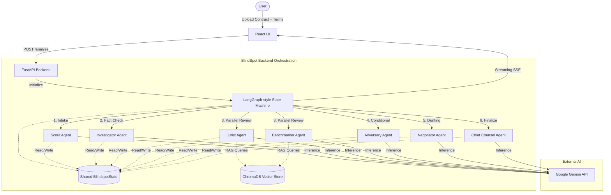

# ⚖️ BlindSpot: Autonomous Legal Agent

**BlindSpot v2.0** is an advanced, autonomous legal agent designed for comprehensive contract review and negotiation. Simply upload a contract, specify your desired terms, and watch an orchestration of specialized AI agents analyze, critique, and negotiate with the counterparty on your behalf—all in real time.

---

## 🌟 Key Features
- **Multi-Agent Orchestration**: Powered by a LangGraph-style state graph, a crew of 7 distinct AI personas collaboratively review contracts.
- **Real-Time Streaming**: Utilizing Server-Sent Events (SSE), the React frontend provides live updates as each agent completes its analysis.
- **Grounded Reasoning**: Employs **ChromaDB** as an embedded vector database to ground agent responses in actual legal rules, statutes, and benchmarks.
- **Parallel Processing**: Architecture supports parallel execution of non-dependent agents (e.g., Jurist and Benchmarker) for faster analysis.
- **Robust State Management**: A single, shared mutable state (via Pydantic v2) ensures type safety, transparency, and reconciliation.

---

## 🏗️ Architecture

BlindSpot is structured around a specialized multi-agent workflow coordinated by a FastAPI backend. Below is the system architecture:



### The Agent Crew
1. **Scout**: Performs the initial scan and classification of the contract.
2. **Investigator**: Maps entities, performs fact-checking, and extracts metadata.
3. **Jurist**: Compares contract clauses against curated legal statutes and rules using Vector Search.
4. **Benchmarker**: Evaluates the contract against market standards.
5. **Adversary**: Simulates counterparty behavior, identifies risk edges, and stresses terms.
6. **Negotiator**: Drafts strategic counter-proposals and alternative language.
7. **Chief Counsel**: Reconciles the output from all previous agents and delivers a final unified verdict.

---

## 🛠️ Project Structure

```text
blindspot/
├── backend/          
│   ├── src/          # FastAPI backend and core logic
│   │   ├── api/      # API routing and SSE endpoints
│   │   ├── agents/   # AI agent definitions
│   │   ├── cache/    # Demo cache and fallbacks
│   │   ├── config.py # App configuration
│   │   ├── orchestration/ # LangGraph-style workflows
│   │   ├── retrieval/# ChromaDB integrations
│   │   ├── state/    # Pydantic State definitions
│   │   └── tools/    # Agent toolkits
│   ├── tests/        # Pytest suite
│   ├── pyproject.toml
│   └── .env.example
├── frontend/         # React streaming frontend
├── data/             # Curated corpora (legal rules, benchmarks, statutes)
├── scripts/          # Setup, demo, and utility scripts
└── docker-compose.yml
```

---

## 🚀 Quickstart

### Prerequisites
- **Python** >= 3.10
- **Node.js** >= 18
- **Docker** (optional, for containerized execution)
- **Google Gemini API Key**

### 1. Environment Setup
Create a `.env` file in the `backend` directory based on the example:
```bash
cp backend/.env.example backend/.env
# Add your GEMINI_API_KEY to the .env file
```

### 2. Backend Setup
```bash
cd backend
python -m venv venv
# Windows: .\venv\Scripts\activate
# Unix: source venv/bin/activate
pip install -e .
uvicorn src.api.main:app --reload --port 8000
```

### 3. Frontend Setup
In a separate terminal:
```bash
cd frontend
npm install
npm run dev
```

### 4. Full Stack with Docker
Alternatively, you can spin up the entire stack using Docker Compose:
```bash
docker-compose up --build
```

---

## 🎬 Demo

To see BlindSpot in action without requiring manual uploads or a full setup, you can run the provided 90-second automated demo script:

```bash
./scripts/run_demo.sh
```
*Note: Refer to [DEMO.md](DEMO.md) for more information on the automated demo flow.*

---

## 🧠 Technical Decisions
- **FastAPI + SSE**: Selected for robust asynchronous support. Server-Sent Events prevent long-polling UI blockers and provide immediate transparency for the user.
- **Shared Pydantic State**: Using Pydantic v2 offers zero-cost validation. It allows Chief Counsel to cleanly reconcile a unified immutable-like history.
- **ChromaDB**: Chosen for being a lightweight, serverless vector store perfect for securely managing curated private corpora without relying on heavy cloud databases.
- **Demo Cache Layer**: Includes hard-coded responses for the demo contract to guarantee consistent demonstrations even in the event of LLM latency or API outages.
